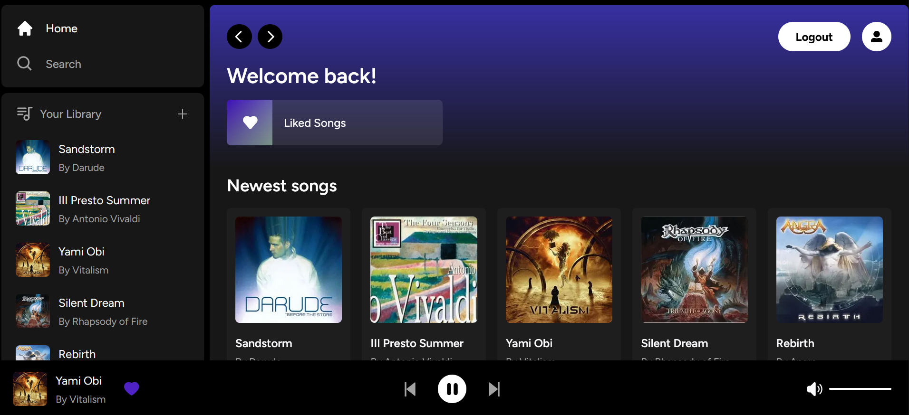

# [Ekko](https://ekko9.vercel.app/) Music Platform that allows users to upload music and organize playlists. Offers a paid version as a SASS.

  

  

> <h2>Part of the tech stack/features used on the app includes:</h2>
>  

- [x] User authentication
- [x] Dynamic real player
- [x] Music and image uploads for creating playlists
- [x] SASS option for subscriptions (disabled for this demo)
- [x] Stripe API for payments (On SASS version)
- [x] Relational databases with Node.js, Supabase and PostgreSQL
- [x] State management using Zustand
- [x] Styling with TailwindCSS and Radix UI

 

> <h2>Technologies applied:</h2>

 

